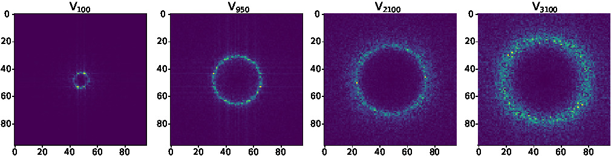

## Dataset Dynamics

This repository contains code to study the dynamics of latent spaces of image datasets. With this simple codebase, you can observe and obtain simple PDEs from complex image datasets in PyTorch.



Shown above is the spectral eigenimage evolution for the PCAM dataset. Shown are eigenimages corresponding to (sorted) indices j ∈ {100, 950, 2100, 3100}.

## Environment

To install the environment, please use pyenv:

```
pyenv install 3.10.18
pyenv local 3.10.18
python -m venv ~/.virtualenvs/latent
source ~/.virtualenvs/latent/bin/activate
pip install -e .
```

Make sure to install [PySINDy](https://github.com/dynamicslab/pysindy) too.

## Project Structure 

```
dataset_dynamics
├── README.md
├── pyproject.toml
├── notebooks
│   ├── misc
│   └── pysindy
├── scripts
│   └── AE_fft.py
└── src
    ├── __init__.py
    ├── __pycache__
    ├── datasets.py
    ├── global_config.py
    ├── helpers.py
    ├── models.py
    └── plot_data.py
```

- `README.md`: This file
- `pyproject.toml`: Contains project dependencies
- `notebooks/misc/`
  - `gaussian_curve_fit.ipynb`: Notebook showing how to fit a gaussian to an arbitrary curve
  - `layer_spectrum.ipynb`: Notebook that plots the spectrum of the layers of an MLP
  - `mnist_width.ipynb`: Notebook playing around with converting radial integrals to gaussian as a preprocessing step.
  - `model_plot.ipynb`: Notebook showing the transition frames collected for various model configurations. Contains hard-coded values from empirical observations but makes cool plots.
  - `PNormIntegrals.ipynb`: Notebook that allows you to obtain the P-Norm of PyTorch image datasets.
  - `transition_frame.ipynb`: Notebook that computed the transition from automatically for various model configurations.
- `notebooks/pysindy/`
  - `PDE_heirarchy_*`: Contains code and final PDFs/PDEs for various datasets under various preprocessing regimes
  - `mnist_ensemble.ipynb`: Calculates the PDE from MNIST using PySINDy PDE_FIND Ensembling
- `scripts/AE_fft.py`: Main code for generating images and training AE MLP, please look at the command line options in this file for detailed explanation of inputs and configurations.
- `src/`: Contains helpers functions for `scripts/AE_fft.py`

